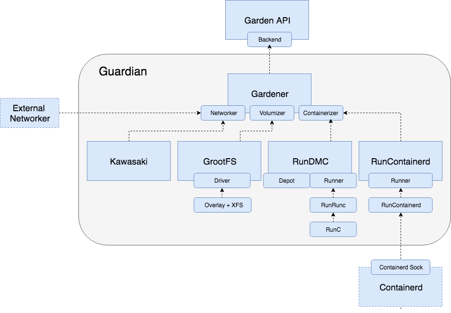

# Garden-RunC Operator's Manual

## Overview

Garden is a cross-platform API for managing containers using containerization technologies like [containerd](https://github.com/containerd/containerd), [runc](https://github.com/opencontainers/runc) or [winc](https://github.com/cloudfoundry/winc-release).

Note: For historical reasons, the garden bosh release is called "garden-runc-release" although it may be deployed with any containerization backend.

## Containerd or Runc?

When operating Garden on Linux it is important to understand that it can run in one
of two modes - `runc` mode and `containerd` mode. When you use an ops file like
[this one](../manifests/containerd.ops.yml) Garden is going to use a colocated
`containerd` instance. Otherwise it will fall back to using `runc`.

**Important**: Containerd mode is the default for cf-deployment above `v6.2.0`. You can opt back into
runc mode by using the [cf-deployment/use-native-garden-runc-runner.yml](https://github.com/cloudfoundry/cf-deployment/blob/fdf94079e7ed3b9ccd28fb092aade67b17c3930a/operations/experimental/use-native-garden-runc-runner.yml) ops file.

### How do I know which mode I'm using

It is easy to determine the Garden mode of your deployment. You are using `containerd`
if any of these conditions are satisfied:
- The deployment manifest defines a job named `containerd`
- The job named `garden` has the `containerd_mode` property set to `true`

If none of the above conditions hold you are using runc.

Based on the configuration of your deployment you can find more details in the respective ops guides:

### Containerd mode

[Containerd mode guide.](opsguide-containerd.md)

### Runc mode

[Runc mode guide.](opsguide-runc.md)

## Garden Components

Guardian consists of three primary "modules", these are the Networker, the Volumizer and the Containerizer.

## Volumizer

The default component used by Garden to manage rootfs volumes is called GrootFS. Garden allows the volumizer to be overridden by specifying the `image_plugin` family of BOSH properties.

### The Graph

The graph stores the filesystem layers which make up the root filesystem images for containers. In the case of docker images these are downloaded from a remote docker registry. In the case of "preloaded" root filesystems these are imported from a path on disk.

To determine which path in the graph is being used as the root filesystem of a particular container, you can look for the "rootfs" property inside RunC's bundle config, the `config.json` file. Here is how to find this file in [containerd mode](opsguide-containerd.md#the-bundle-config) and in [runc mode](opsguide-runc.md#the-bundle-config).

Garden's rootfs layer management is handled by a component called [GrootFS](https://github.com/cloudfoundry/grootfs) which stores its graphs at `/var/vcap/data/grootfs/store/{unprivileged,privileged}`. To understand more about graph disk usage with GrootFS, refer to [this doc](understanding_grootfs_store_disk_usage.md).

### GrootFS

The [GrootFS](https://github.com/cloudfoundry/grootfs-release) module implements the `image_plugin` contract. GrootFS is the built-in root filesystem management component which is used by default. GrootFS uses `overlay` to efficiently combine filesystem layers, along with an `xfs` base filesystem mounted with a loop device to implement disk quotas.

### Garden-Shed

Garden-Shed is the **deprecated** root filesystem management component, which has now been removed in versions above 1.16.8.

## Networker

The default component used by Garden to manage networks is called Kawasaki. Garden allows the networker to be overridden by specifying the `network_plugin` family of BOSH properties.

### Kawasaki

Kawasaki is Guardian's built-in networking component, used by default and if no `network_plugin` is configured. Kawasaki is invoked to configure the network of a created container before any user processes are run.

### External networker

The [container-to-container networking project](https://github.com/cloudfoundry-incubator/netman-release) implements the `network_plugin` contract.

### [Configuring CPU entitlement](cpu-entitlement.md)

## Nomenclature

- garden-runc-release: the bosh release for this project
- garden: the API, sometimes refers to guardian
- guardian (also, gdn): the server handling API requests
