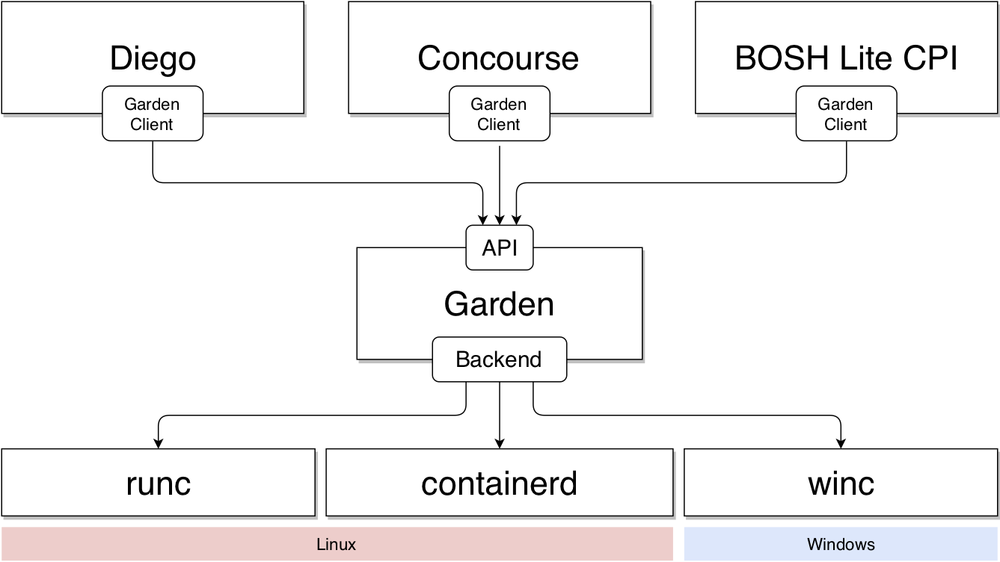
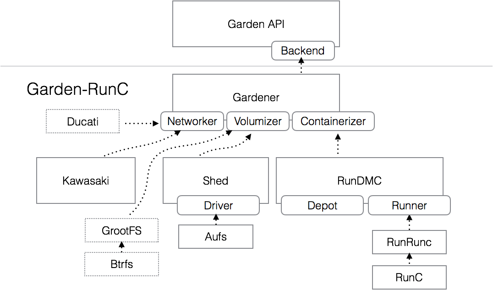

# Garden-RunC Operator’s Manual

### A Note on Naming: Garden, Garden-RunC and Guardian

Garden is a cross-platform API for managing containers with multiple implementations, referred to as "Back-ends". Back-ends include garden-windows and garden-runc. This document describes garden-runc. Garden-RunC (which is the overall product) primarily uses the "Guardian" component to implement the "Garden" API using "runC".

## Important Directories

### The Depot

Guardian stores container bundles in the standard OCI format underneath a directory called "the depot". 

If you deployed guardian using garden-runc-release the depot is located at `/var/vcap/data/garden/depot`. 

#### Container subdirectories

Each subdirectory of the depot describes a single container in a format known as an "OCI Bundle". This is essentially a directory containing an OCI-format `config.json` which is the configuration passed to `runc create` to create a container. 

#### Process subdirectories

For each process created inside the container (via the garden `container.Run` API) a subdirectory is created in `$depot_dir/$container_handle/processes/$process_guid`.

Inside this directory are named pipes (FIFOs) representing the stdin/out/err streams, a pipe named ‘exit’ which remains open while the process is open and then is closed when it exits and a named pipe named ‘winsz’ which is used to communicate window size change events to the running process. These files are connected to the container process by the `dadoo` helper executable (described below), allowing guardian to re-connect to the process’s streams and wait for the process to exit even after restarting.

#### Partially-unshared processes

Many container processes share everything with other processes in the same
container. At the runC level, these are also modelled as processes "inside" a
container, and can be listed using `runc ps`. However, using the fields `Image`
or `OverrideContainerLimits` on a `ProcessSpec`, processes that do not share
everything with other processes in the same container can be created.

At the runC level, these "partially unshared" Garden processes are not runC
processes, but runC containers. This separate container will still share many
of its resources with the initial runC container that was created when we
created the Garden container that this process is a member of.

Like the other runC containers, these process containers also have a bundle
directory. It is located in
`$depot_dir/$outer_container_handle/processes/$inner_container_dir/` and is a
combination of the `Container subdirectories` and the `Process subdirectories`
described above. The directory contains a `config.json` which describes the
"inner container" that is going to be created when calling `runc run -d` and
also the pipes and `pidfile` of the process that is going to run in that
container.

The newly created container can be seen by running `runc list`, and all
container-related operations apply to it as usual. Using its id, you can get
information about the partially-unshared process through `runc ps <id>`.

### The Graph

The graph stores the filesystem layers which make up the root filesystem images for containers. In the case of docker images these are downloaded from a remote docker registry. In the case of "preloaded" root filesystems these are imported from a path on disk. 

To determine which path in the graph is being used as the root filesystem of a particular container, you can look for the “rootfs” property inside the `config.json` file in the container’s bundle directory.

If you installed garden-runc-release using bosh, the graph is located at `/var/vcap/data/garden/aufs_graph`. 

## Guardian Components

Guardian consists of three primary “modules”, these are the Networker, The RootFS Manager and the Containerizer. In a default garden-runc installation, these are implemented by the built-in “kawasaki”, “garden-shed” and “rundmc” components, respectively.

It is possible to override the networker and the rootfs manager by specifying, respectively, the `network_plugin` and/or the `image_plugin` bosh properties. Setting either of these properties to the path of a binary will cause guardian to shell out to that binary to create the network and/or to download and prepare the root filesystem for the container._

The [container-to-container networking project](https://github.com/cloudfoundry-incubator/netman-release) implements the `network_plugin` contract and the “[grootFS](https://github.com/cloudfoundry/grootfs-release)” overlay/xfs-based oci-compliant rootfs manager implements the `image_plugin` contract.

### RunDMC

RunDMC is Guardian’s containerizer. It is a super-small wrapper around runc with two jobs. Firstly it manages the ‘depot’ directory (see above), creating, listing and destroying container bundles as requested (in the code this is the `DirDepot` component). Secondly it executes `runc` commands to actually create, run and manage the container lifecycle (in the code this is the `RuncRunner` component).

### Garden-Shed

Garden-Shed is the built-in root filesystem management component which is used by default and if no `image_plugin` is configured. Garden-shed uses `aufs` to efficiently combine filesystem layers, along with dynamically created loop devices to implement disk quotas. 

### Kawasaki

Kawasaki is Guardian’s built-in networking component, used by default and if no `network_plugin` is configured. Kawasaki is invoked to configure the network of a created container before any user processes are run. 

### Dadoo

At runtime, you will see that guardian itself runs as a daemon process to which your client connects (normally over a unix socket). For each running container, guardian uses the `runc create` command against a particular bundle directory in the depot dir to create a container. This container immediately runs a no-op “init” process which simply sleeps (garden does not support overriding the init process in containers as this is a special system process). As processes are run inside the container (for example user apps), guardian spawns a process named `dadoo` which then calls `runc exec` to run the requested process (in other words, [dadoo runs runC](https://www.youtube.com/watch?v=dqgtsai2aKY)). Dadoo keeps running as long as the user’s process runs, monitoring its exit status and eventually writing it to a file in the `processes/$processid` subdir. If guardian is restarted it is able to reconnect to the running process via dadoo.

## Interacting with a Container

At runtime, bundles from the depot directory are run using [runC](http://github.com/opencontainers/runc). As these are standard runc containers and processes, you can interact with them for debug purposes using runc itself (or any compatible tool). For example, to execute a process in a container you can execute `/var/vcap/packages/runc/bin/runc exec $containerid /bin/sh` (where $containerid is the directory name of the depot subdirectory in question), to get events from a container you can run `/var/vcap/packages/runc/bin/runc events $containerid` and so on. More documentation on runC is available [on its github page](http://github.com/opencontainers/runc).
