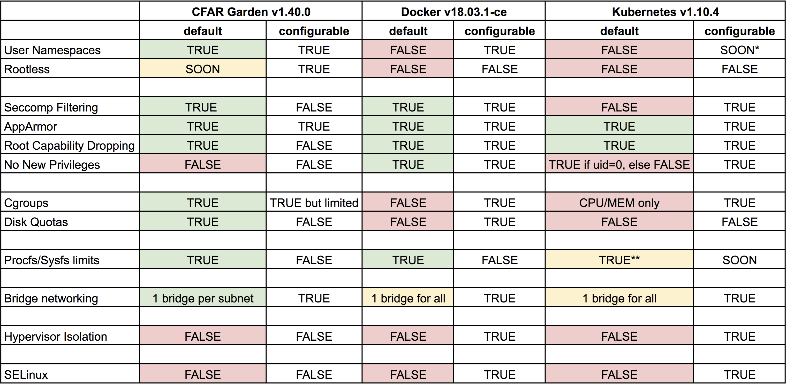

# Security Overview

The following table provides an overview of container security mechanisms across various container systems.
Table last updated 15/06/18.

* https://github.com/kubernetes/kubernetes/pull/64005 \*
* Fewer masked paths than garden/docker (e.g. /proc/scsi) \*\*
* Table inspired by: https://blog.jessfraz.com/post/containers-security-and-echo-chambers

## Environments

* Cloud Foundry Application Runtime v1.40.0 - Standard deployment on Ubuntu trusty stemcell
* Docker v18.03.1-ce - Standard install on Ubuntu xenail
* Kubernetes v1.10.4 - Standard deployment on GCP via [kube-up.sh](https://github.com/kubernetes/kubernetes/blob/v1.10.4/cluster/kube-up.sh)
